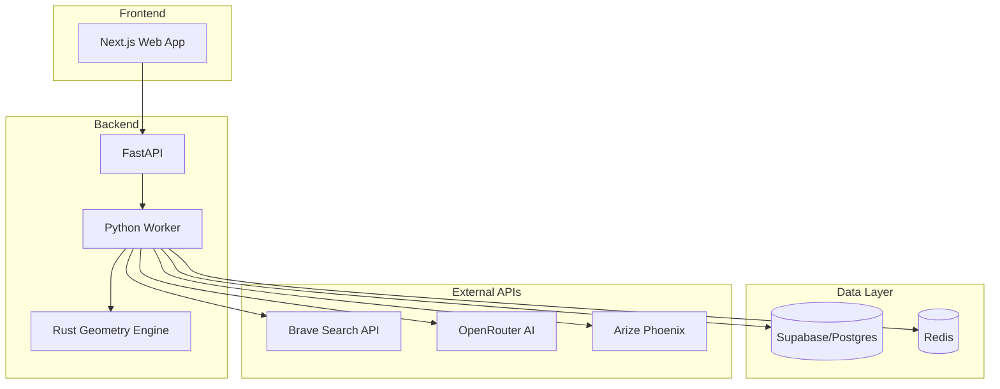

# Architecture

## System Overview

FlurPilot follows a modern, scalable architecture with clear separation of concerns.

## Component Diagram

## Tier 1: OParl Integration

Gold standard - direct API access to municipal systems:

- Structured data
- Real-time updates
- Official source

## Tier 2: Search API

For municipalities without OParl:

- **Primary**: Brave Search API (replaces deprecated Bing)
- **Fallback**: Google Custom Search
- PDF discovery with site-specific queries

## Tier 3: AI Analysis

LLM-powered document analysis:

- **Models**: Claude Opus/Sonnet/Haiku via OpenRouter
- **Observability**: Arize Phoenix for tracing and cost monitoring
- **Cost Tracking**: Automatic per-call cost estimation

## Geometry Engine

High-performance parcel calculations:

- **Language**: Rust with PyO3 bindings
- **Operations**: Union, Difference, Area calculation
- **Performance**: 10-100x faster than Python/Shapely
- **Formats**: GeoJSON in/out

## Security Architecture

Zero Trust principles:

1. **Client-side keys**: No server storage of sensitive credentials
2. **Row Level Security**: Supabase RLS policies
3. **No data egress**: Private data stays in EU
4. **Audit logging**: All operations tracked

## Deployment

Infrastructure as Code with Terraform:

- **Cloud**: Hetzner Cloud (EU-based)
- **Containers**: Docker + Docker Compose
- **CI/CD**: GitHub Actions
- **Monitoring**: Infracost for cost estimation
